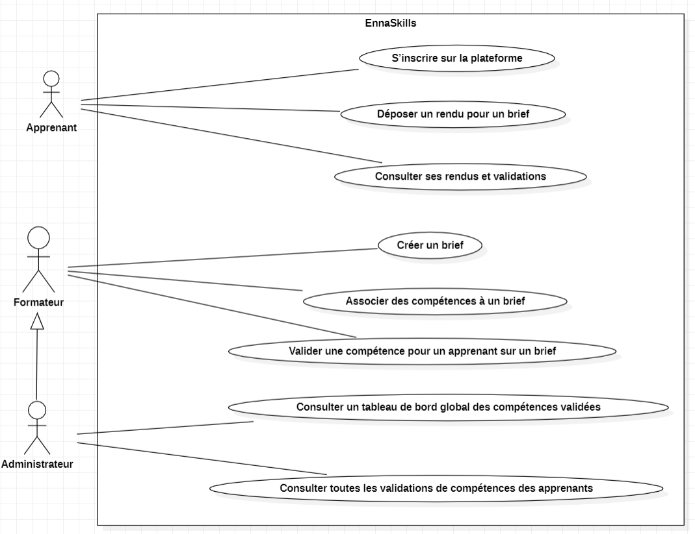
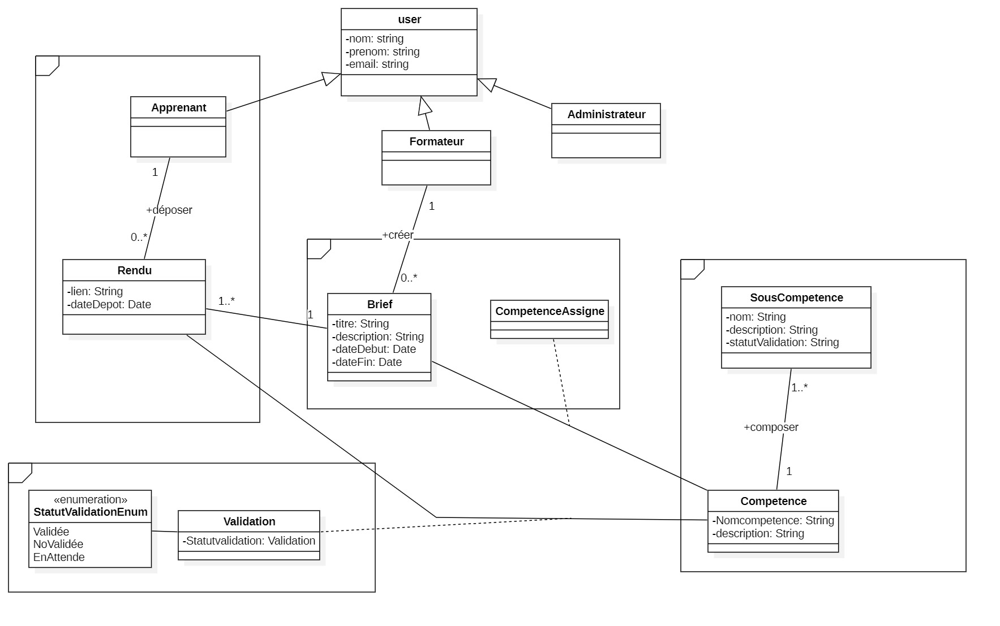

# 📚 ENAA Skills – Plateforme de Suivi des Compétences

**ENAA Skills** est une plateforme pédagogique conçue pour suivre l'acquisition des compétences des apprenants, en lien avec les briefs pédagogiques. Le projet est basé sur une architecture **microservices** avec communication inter-services via **Feign Client**.

---

## 🚀 Fonctionnalités Clés

### 🎯 Brief-Service
- 👨‍🏫 Création de briefs pédagogiques
- 🔗 Association de compétences aux briefs

### 👨‍🎓 Apprenant-Service
- 📝 Inscription des apprenants
- 📂 Dépôt de rendus
- 📊 Consultation des rendus avec état des compétences validées

### ✅ Validation-Service
- ✔️ Validation de compétences sur un rendu
- 👀 Vue globale des validations par apprenant (pour formateur/admin)

##  Diagrammes UML
### 🎯 1. Diagramme de Cas d’Utilisation (Use Case)

### 🧩 2. Diagramme de Classes 

### ⏱️ 3. Diagramme de Séquence 